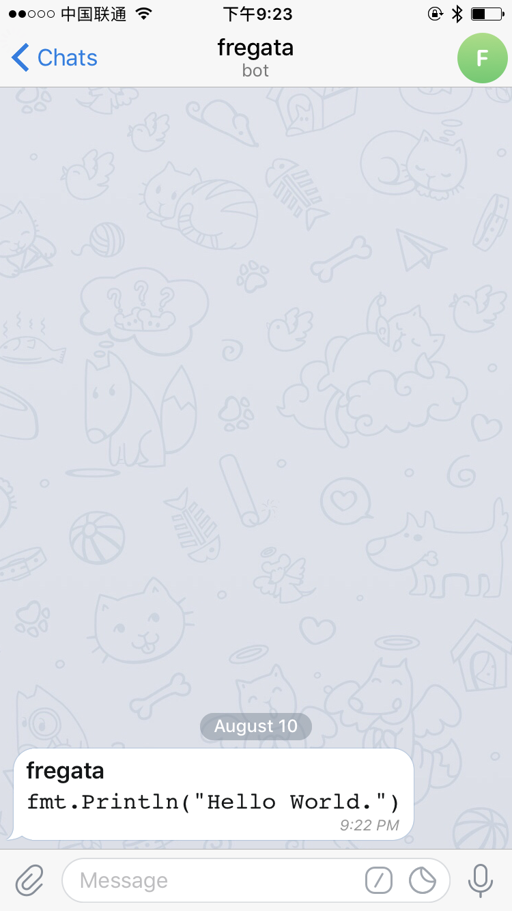

## slack

```bash
curl -X POST \
  http://127.0.0.1:2017/fregata/v1/slack \
  -H 'content-type: application/json' \
  -d '{"text":"test", "username": "fregata", "channel": "@qingfeng", "icon_emoji": ":medal:"}'
```


## wechat

```bash
curl -X POST \
  http://127.0.0.1:2017/fregata/v1/wechat \
  -H 'content-type: application/json' \
  -d '{"text": "😃", "to": "filehelper"}'
```


## telegram

```bash
curl -X POST \
  http://127.0.0.1:2017/fregata/v1/telegram \
  -H 'content-type: application/json' \
  -d '{"text": "*fregate*\n```go\nfmt.Println(\"Hello World.\")\n```"}'
```


